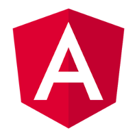

# Courses of Angular

This is the source code of all projects I did in courses of Angular. This courses are videos in Udemy, books, youtube and tutoriais.

## JSON Web Token with Spring Security And Angular

> Folder: angular-jwt-with-spring

Course of Spring Security using Angular as frontend.

Creator: [Get Arrays](https://youtu.be/FMGQsW_B9Rs)

## Samples with Angular

> Folder: samples-angular

Some random samples of Angular components and tricks.

Creator: ailtonbsj

## Trabalhando com Páginas SPA com Angular

> Folder: dio-angular-spa

An online course of Angular from [Digital Innovation One](https://web.dio.me/course/trabalhando-com-paginas-spa-com-angular/learning/f91b184b-6140-471d-b764-9d3ba0ab8186).

Creator: Camila Ribeiro

## Laravel and Angular - API Authentication with Laravel Passport

> Folder: angular-jwt-with-laravel-passport

Tutorial from Youtube about JWT with Angular and Laravel Passport.

Creator: [My IOT Lab Channel](https://youtube.com/playlist?list=PL397yT3D1n9ipqiMZug6mdPIczG2fmfjK)

## Angular & Laravel JWT Authentication

> Folder: angular-jwt-with-laravel-sanctum

Tutorial from Youtube about JWT with Angular and Laravel Sanctum.

Creator: [Scalable Scripts Channel](https://youtube.com/playlist?list=PLlameCF3cMEtVCB8awarHu1NjIyEX0Va9)

## Angular 2+

> Folder: loiane-angular

An online course of Angular 2 from [Loiane Training](https://loiane.training/cursos).

Creator: Loiane Groner

## Introdução ao Angular 8

> Folder: course-manager

An online course of Angular 8 from [Digital Innovation One](https://web.dio.me/course/introducao-ao-angular-8/learning/2d97a376-c570-45e3-9f32-f756f98804ab).

Creator: Wesllhey Holanda

## Angular 9 Essencial [2020]

> Folder: angular-crud

An online course of Angular 9 from [Udemy](https://www.udemy.com/course/angular-9-essencial/).

Creator: Leonardo Moura Leitao

## AngularJS

> Folder: green.angularjs

An book called AngularJS by Brand Green and Shyam Seshadri.

Creator: Brand Green and Shyam Seshadri

## AngularJS

> Folder: branas.angularjs

An [playlist from Youtube](https://www.youtube.com/playlist?list=PLQCmSnNFVYnTD5p2fR4EXmtlR6jQJMbPb) about AngularJS.

Creator: Rodrigo Branas
